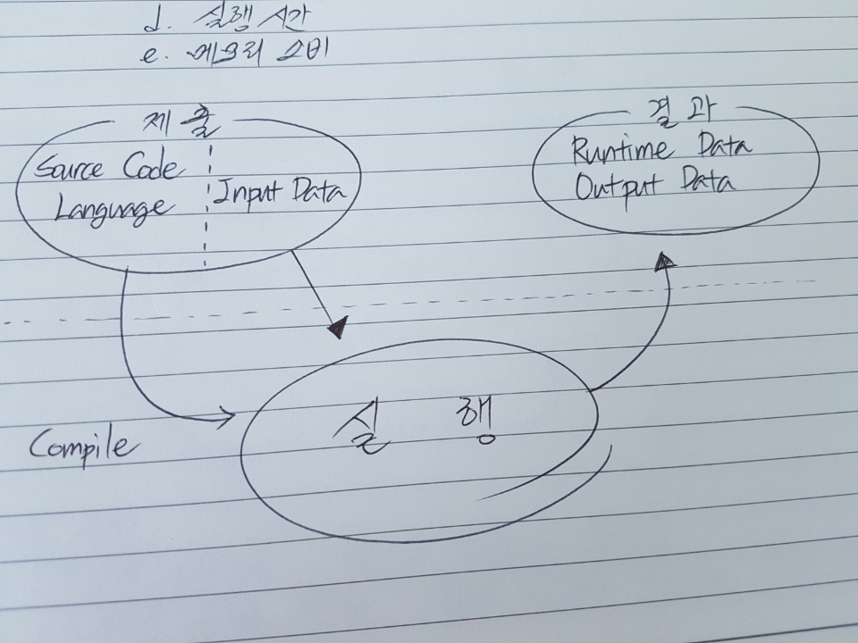
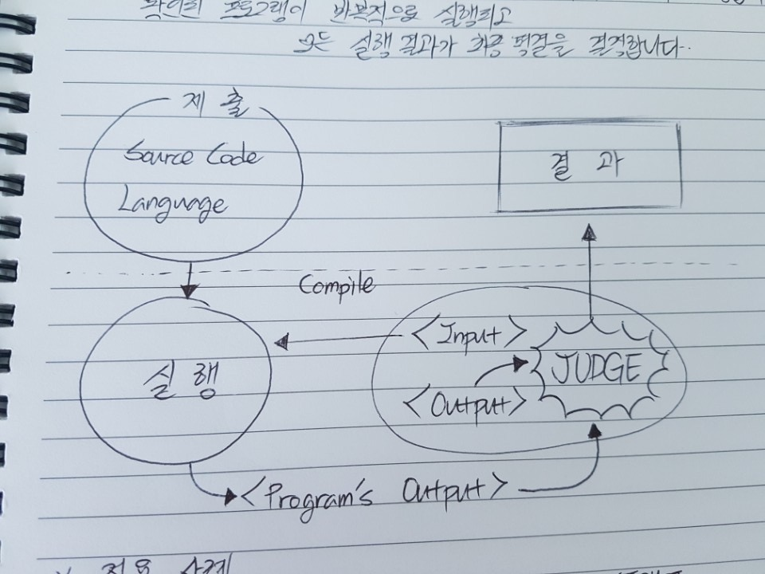

# Sphere Engine

## 공부하게된 시점

> 현재 개발해야하는 우리 회사의 웹앱에서  
사용되고있는 라이브러리라 빠른 이해가 필요해서 시작.

## Module 구분

> 일단 모듈이 뭔지를 몰라서 검색해본 결과.  
가장 마음에 들었던 대답은..!  
"본체에서 분리되어 작은 부분으로 유기적으로 구성되어있다가,  
필요할 때 본체에 합류하여 그 기능을 수행할 수 있는것."  

> Sphere Engine은 2개의 Module로 이루어져 있다.  

> Compilers + Problems

## Compilers

> 컴파일러 모듈은  
컴퓨터 프로그램을 원격 실행하고  
실행결과를 다운로드 할 수 있게 해주는 서비스.  

### 기능
> 1. 프로그램의 소스코드를 실행.  
1.5 (선택사항) 실행하고 싶은 프로그램의 입력 데이터 지정.
>2. 다음을 포함한 실행결과 다운로드.  
a. 소스코드에 대한 오류 및 경고  [ ex)컴파일 에러 ]  
  b. 출력 data  
  c. 런타임 에러  
  d. 실행시간  
  e. 메모리 소비

  

### 적용 사례

>1. 응시자가 작성한 코드를 실행할 수 있는 채용을 위한 인터뷰 플랫폼.
>2. 프로그램 실행 예제가 풍부한 온라인 프로그래밍 교육.
>3. 실행 가능한 소스코드를 공유하기위한 시스템.

## Problems
> 프로그래밍 문제를 관리하고,  
이러한 문제에 대한 해결책을 자동으로 확인할 수 있게 해주는 서비스.

### 기능
>1. 프로그래밍 문제를 관리할 수 있는 기능적 CMS(contents management system)
>2. 바로 사용가능한 문제 라이브러리
>3. RESTful APIView

### 문제풀이 검증과정

> 문제에 대한 풀이의 정확성을 자동으로 검증하는 것은,  
프로그래밍 문제를 생성할 때 정의해야하는  
소위 TEST 사례를 토대로 작동합니다.  
확인된 프로그램이 반복적으로 실행되고, 모든 실행결과가 최종 평결을 결정합니다.

  

### 적용사례

>1. IT업계 지원자를 자동으로 평가하는 플랫폼.
>2. 프로그래밍 문제를 포함하는 시험과 테스트를 제공하는 온라인 학습 플랫폼.
